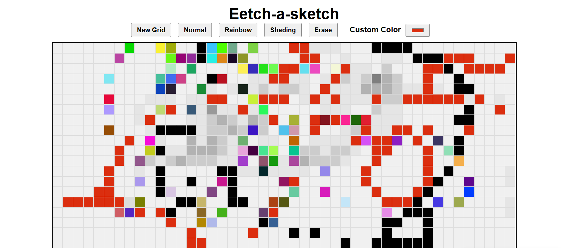

# Etch-a-sketch

A dynamic, interactive Etch-a-Sketch web application built with **HTML, CSS, and JavaScript**. This project allows users to draw on a grid canvas with multiple nodes, reset the grid and clear their drawings and customize colors.

## Features

- **Dynamic Grid Creation**: Default 16x16 grid, adjustable up to 100x100 squares.
- **Drawing Modes**: -**Normal Mode**: Hovering paints squares black. -**Rainbow Mode**: Hovering paints squares with random colors. -**Shading Mode**: Hovering progressively darkens squares by 10% per pass, reaching full black after 10 hovers. -**Custom color Mode**: user can select any color using a color picker. -**Erase / clear Button**: Reset all squares without changing the grid size. -**New Grid Button**: Prompts the user to enter a custom grid size.

## How to use

1. open `index.html` in your browser.
2. Hover over the squares in the grid to draw.
3. use the buttons above the grid:
   - **Normal**: Paint black.
   - **Rainbow**: Paint random colors.
   - **Shading**: Gradually darken squares.
   - **Erase**: Clear all squares.
   - **New Grid**: Create a grid with a user-defined size.
4. Use the **Custom Color** picker to draw with your chosen color.

## Techonologies Used

- **HTML5** for structure.
- **CSS3** for styling and layout using Flexbox.
- **JavaScript (DOM manipulation)** for dynamic grid creation and interactive features.

## Notes

- Flexbox is used to create a **responsive grid layout**.
- `dataset` attributes are used to track hover count for shading mode.
- Event listeners are used to handle hover effects, button clicks, and color picker changes.

## Live Demo

You can host this repository on **GitHub Pages**:

1. Go to your repo → Setting → Pages
2. Select your branch (main) and root folder
3. Access your live project at: `https://<your-username>.github.io/<repo-name>`

---
